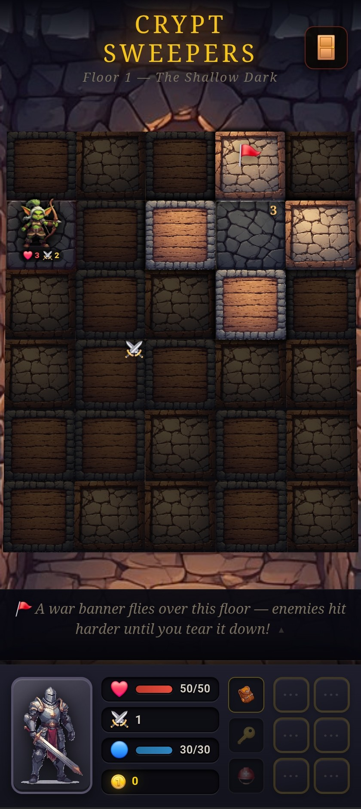

<p align="center">
  
  
  
  
  
</p>

<h1 align="center">⚔️ Crypt Sweepers ⚔️</h1>

<p align="center">
  <em>A minesweeper-style dungeon crawler — flip tiles, fight monsters, descend 100 floors.</em>
</p>

<p align="center">
  <a href="https://Crypt-Sweepers.com">🎮 Play Now in Your Browser</a>
</p>

<p align="center">
  
</p>

---

## What Is This?

**Crypt Sweepers** is a roguelike tile-flipper built for mobile (and desktop). Every floor is a hidden grid of tiles. You start on one revealed tile and expand outward by flipping adjacent tiles — but you never know what's underneath. Gold? A healing well? Or something with teeth?

Think **Minesweeper meets a dungeon crawler**. Threat numbers tell you how much danger surrounds a tile. Plan your path, manage your resources, and try not to die.

> No app store. No downloads. No ads. Just open the link and play.

---

## 🗡️ Choose Your Hero

Each hero plays the dungeon differently:

| Hero | Passive | Playstyle |
|------|---------|-----------|
| **Paladin** | **Sense Evil** — One hidden enemy is marked each floor. Slay it and another is revealed. | Tanky frontliner. Slam hits every enemy on the board. |
| **Ranger** | **Keen Eyes** — 50% chance on each flip to sense what's hiding in adjacent tiles. | Ranged attacker. Ricochet, Arrow Barrage, and Poison Arrow. |
| **Mage** | **Phase Walk** — 50% chance on each flip to unlock diagonal movement. | Fragile but high mana. Moves like a queen, not a rook. |
| **Vampire** | **Corrupted Blood** — Lose 1 HP per flip, drain 1 HP from every visible monster. | Risk/reward. Gets stronger the more enemies are exposed. |
| **Engineer** | **Turret Deployment** — Build turrets that auto-fire on revealed enemies. | Tactical. Constructs, gadgets, and area denial. |

---

## 🏰 11 Biomes, 100 Floors

Descend through increasingly dangerous environments. Each biome brings unique enemies, new hazards, and a fresh coat of dread.

```
 Floors  1–5    Standard Dungeon      🏚️  Learn the ropes
 Floors  6–10   Jungle Ruins          🌿  Overgrown and hostile
 Floors 11–20   Frozen Tundra         🧊  Freezing hits slow you down
 Floors 21–30   Volcanic Cavern       🌋  Fire and fury
 Floors 31–40   Catacombs             💀  The dead don't rest
 Floors 41–50   Corrupted Forest      🍄  Poison and decay
 Floors 51–60   Sunken Temple         🌊  Waterlogged ruins
 Floors 61–70   Mushroom Grotto       🍄  Spore-filled depths
 Floors 71–80   Crystal Cavern        💎  Shimmering and sharp
 Floors 81–90   Shadow Realm          🌑  Light itself fails
 Floors 91–100  Infernal Pit          🔥  The final descent
```

---

## 🎲 Core Mechanics

- **Tile Flipping** — Reveal adjacent tiles to explore the floor. Threat numbers (like Minesweeper) hint at nearby danger.
- **Combat** — Tap an enemy tile to fight. Manage HP, mana, and abilities to survive.
- **Trinkets** — Collect 60+ items that stack, combine, and break the game in fun ways. Find a Forge to fuse two trinkets into something legendary.
- **Sub-Floors** — Hidden passages lead to mob dens, boss vaults, treasure rooms, shrines, and ambushes.
- **Boss Floors** — Every 10th floor features a boss. Defeat it to unlock the stairs deeper.
- **Meta-Progression** — Gold earned each run persists through death. Unlock heroes, buy passive upgrades, and power up your XP tree between runs.
- **Bestiary** — Discover and catalog 30+ enemy types across all biomes.

---

## 📱 Install as an App

Crypt Sweepers is a **Progressive Web App**. On mobile:

1. Open the game in your browser
2. Tap **Share → Add to Home Screen**
3. Play offline, anytime

On desktop, look for the install icon in your browser's address bar.

---

## 🛠️ Run Locally

```bash
npm install
npm start          # serves at http://localhost:3456
npm test           # unit tests
```

No build step — pure ES6 modules served directly.

---

## 🏗️ Tech Stack

- **Vanilla JS** — No framework. No bundler. Just ES6 modules.
- **IndexedDB** — Save data persists locally.
- **Service Worker** — Offline-first caching.
- **CSS** — Hand-crafted tile animations, flip transitions, and combat effects.
- **PWA** — Installable on any device.

---

<p align="center">
  <sub>Built with ⚔️ and ☕ — one tile at a time.</sub>
</p>
